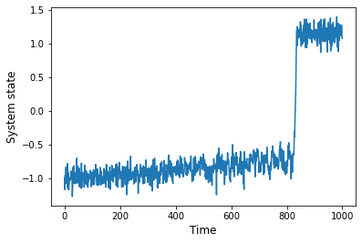
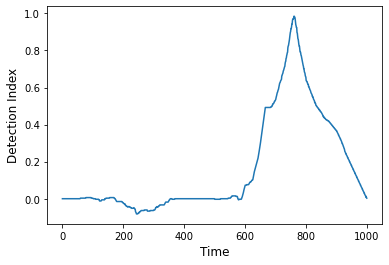
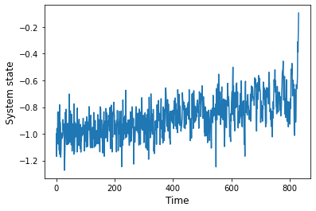
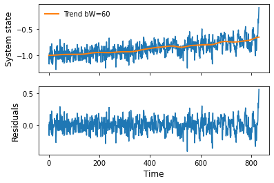
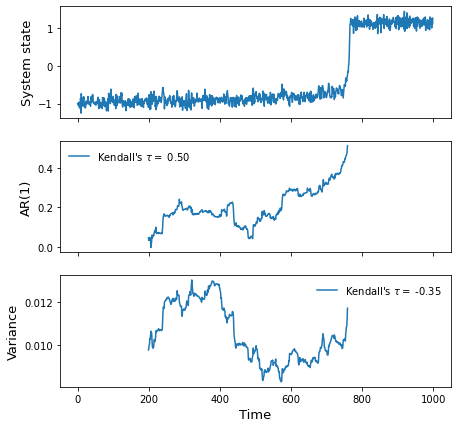
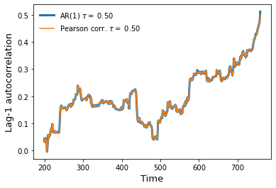
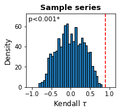
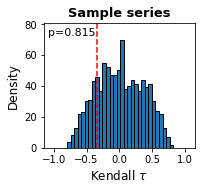
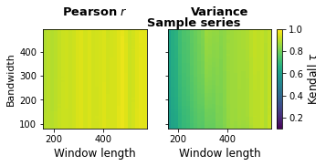

# regimeshifts

`regimeshifts` is a Python library that provides functions for detecting regime shifts and identifying early warning signals for tipping points in time-series.


### Modules
`regimeshifts` contains two modules:

- `regime_shifts`: Provides a method for detecting regime shifts in time-series. 
- `ews`: Provides functions to compute early warning signals or resilience indicators, along with tools to assess their robustness and significance.

This repository can be copied into the working directory using the command:

`git clone https://github.com/BeatrizArellano/regimeshifts.git`

Both modules can be imported as follows, assuming that the folder `regimeshifts` is located at the same level as the script:


```python
from regimeshifts import regime_shifts as rs
from regimeshifts import ews
```

### Creating a time-series with a tipping point

The `sample_rs` function, available in the `regime_shifts` module, generates a time-series using a stochastic differential equation to simulate an abrupt transition induced by a bifurcation, with normally distributed noise and a specified standard deviation.


```python
ts = rs.sample_rs(std=0.1)
```


```python
import matplotlib.pyplot as plt
fig, ax = plt.subplots()
ts.plot(ax=ax)
ax.set_xlabel('Time',fontsize=12)
ax.set_ylabel('System state',fontsize=12);
```


    

    


## Detecting regime shifts

The `Regime_shift` class implements the algorithm proposed by [Boulton and Lenton (2019)](https://doi.org/10.12688/f1000research.19310.1) for detecting regime shifts in a time-series. This method identifies anomalous rates of change along the time-series by detecting large gradients over different segments of the time-series. It segments the time series into fixed-length intervals and applies linear regression to calculate the slope for each segment. Gradients that fall outside three median absolute deviations are deemed anomalous. This process is repeated for a range of segment lengths, from a user-defined minimum to a maximum of one-third the original time series length. The regime shift detection indices are computed as the proportion of segment lengths that exhibit an anomalous gradient at each point in the time series. The resulting index indicates the moments when abrupt changes are likely, marked by a higher frequency of detected anomalous gradients.

To begin, we create an instance of the `Regime_shift` class by providing a `pandas` time-series as a parameter.


```python
ts = rs.Regime_shift(ts)
```

The `as_detect` method computes the regime shift detection index that indicates how frequently each point in the time series is associated with an anomalous rate of change. It returns a time-series of indices in the interval [-1,1]. Values around 0 suggest a low likelihood of abrupt shifts, while values close to -1 or 1 indicate a high probability of an abrupt change occurring at that point. In this example, the largest value is detected precisely when the tipping point is reached in the original series.


```python
detection_index = ts.as_detect()
```


```python
fig, ax = plt.subplots()
detection_index.plot(ax=ax)
ax.set_xlabel('Time',fontsize=12)
ax.set_ylabel('Detection Index',fontsize=12);
```


    

    


The `before_rs` method can be used to extract the data preceding the regime shift:


```python
bef_rs = ts.before_rs()
```


```python
fig, ax = plt.subplots()
bef_rs.plot(ax=ax)
ax.set_xlabel('Time',fontsize=12)
ax.set_ylabel('System state',fontsize=12);
```


    

    


## Early warning signals for tipping points (resilience indicators)

The approach to detecting early warning signals for tipping points is based on identifying the generic symptoms of a phenomenon known as Critical Slowing Down. As a system gradually approaches a tipping point, its recovery rate from perturbations decreases, causing it to become increasingly similar to its past states over time. This behaviour can be detected by measuring temporal changes in lag-1 autocorrelation, variance, skewness, recovery rate, and other indicators. This library implements algorithms to measure temporal changes in lag-1 autocorrelation and variance in time-series. Both metrics tend to increase as the tipping point is gradually approached  ([see Scheffer et al. (2009)](https://doi.org/10.1038/nature08227)).

It is important to note that these metrics do not serve as forecasting tools to predict the distance to the tipping point; rather, they indicate the state of the system and are considered indicators of its resilience or stability ([see Dakos et al. (2015)](https://doi.org/10.1098/rstb.2013.0263)).

Time series are typically detrended before estimating the indicators to avoid artifacts introduced by long-term trends and non-stationarities ([see Lenton et al. (2012)](https://doi.org/10.1098/rsta.2011.0304)). If a time series contains a seasonal cycle, it is also important to remove this cycle before computing the resilience indicators.

The `Ews` class (which stands for Early Warning Signals) includes methods for detrending time series, estimating resilience indicators, and assessing the strength of changes in their trends over time, along with their robustness and significance.

First, we create an instance of the `Ews` class by passing a `Pandas` time-series or dataframe as a parameter. 

In this example, we use the slice of the sample series before the tipping point.

```python
series = ews.Ews(bef_rs)
series = series.rename(columns={0:'Sample series'}) ## The Ews class returns an extended Dataframe object, if we provided a series, it sets 0 for the column name. 
```

The method `gaussian_det` is used to remove the trend using a moving average weighed by a Gaussian function (or a Gaussian kernel smoother). This method receives the bandwidth (`bW`) of the Gaussian smoother kernel as a parameter ([see Lenton et al. (2012)](https://doi.org/10.1098/rsta.2011.0304)).

It returns an object containing two attributes: `trend`, which is a time-series representing the estimated trend, and `res`, which contains the residuals after removing the trend. 


```python
trend = series.gaussian_det(bW=60).trend
residuals = series.gaussian_det(bW=60).res
```


```python
fig, axs = plt.subplots(2,1,sharex=True)
bef_rs.plot(ax=axs[0],label='')
trend['Sample series'].plot(ax=axs[0],label='Trend bW=60',linewidth=2)
residuals['Sample series'].plot(ax=axs[1])
axs[1].set_xlabel('Time',fontsize=12)
axs[0].set_ylabel('System state',fontsize=12);
axs[1].set_ylabel('Residuals',fontsize=12);
axs[0].legend(frameon=False);
```


    

    


### Estimating lag-1 autocorrelation and variance

From the proposed indicators for Critical Slowing Down in the literature, this library includes methods to measure temporal changes in lag-1 autocorrelation and variance in time-series. Lag-1 autocorrelation measures the correlation of a time series with itself shifted by one time step, indicating how current values are related to their immediate past values. To assess how these indicators change over time, they are computed using a sliding window whose size is determined by the user (parameter `wL`). The sliding window can be specified either as a fixed number of data points or as a proportion of the time series (e.g., wL=0.5). These methods can be applied to either the detrended data or the raw data, with detrending performed by setting `detrend=True` and providing the bandwidth size (`bW`). 

The methods for computing lag-1 autocorrelation include `ar1()`, which fits an autoregressive model of order 1, and `pearsonc()`. The `var()` var computes the variance. 


```python
wL = 200 ## Window length specified in number of points in the series
bW = 60
ar1 = series.ar1(detrend=True,bW=bW,wL=wL) ### Computing lag-1 autocorrelation using the ar1() method
var = series.var(detrend=True,bW=bW,wL=wL) ## Computing variance
```

### Measuring the trend in the indicators with the non-parametric Kendall's $\tau$ correlation coefficient

The Kendall $\tau$ coefficient cross-correlates time with the indicator series to assess the strength of change over time. The resulting coefficient ranges from -1 to 1, where values close to 1 indicate an increasing trend, and values close to -1 indicate a decreasing trend (see Lenton et al. (2012)). 

The Kendall coefficient is an attribute of the resulting indicator series and can be computed as follows:

`series.ar1(detrend=True,bW=bW,wL=wL).kendall`.


```python
print(f'AR(1) tau = {ar1.kendall:0.3f}')
print(f'Var tau = {var.kendall:0.3f}')
```

    AR(1) tau = 0.899
    Var tau = 0.628


```python
fig, axs = plt.subplots(3,1,sharex=True,figsize=(7,7))
ts.plot(ax=axs[0],legend=False)
ar1['Sample series'].plot(ax=axs[1],label=rf"Kendall's $\tau =$ {ar1.kendall:.2f}")
var['Sample series'].plot(ax=axs[2],label=rf"Kendall's $\tau =$ {var.kendall:.2f}")
axs[0].set_ylabel('System state',fontsize=13)
axs[1].set_ylabel('AR(1)',fontsize=13)
axs[2].set_ylabel('Variance',fontsize=13)
axs[1].legend(frameon=False)
axs[2].legend(frameon=False)
axs[2].set_xlabel('Time',fontsize=13);
```


    

    


#### AR(1) vs Pearson Correlation Coefficient

The method `ar1()` fits a first-order autoregressive model (AR(1)) using an ordinary least-squares method. This method uses the `AutoReg` function from the `statsmodels`  library, which, while robust, is relatively computationally intensive compared to simpler correlation calculations. In contrast, the `pearsonc()` method utilizes the `Pandas` `autocorr` function to estimate the Pearson correlation coefficient between a time-series and a version of itself shifted by one time unit. 

Despite their differing approaches, both methods typically yield the same results when estimating lag-1 autocorrelation. This consistency provides users with flexibility in choosing an approach that best fits their needs, whether they prioritise computational efficiency or a statistical modeling method. 


```python
pearson = series.pearsonc(detrend=True,bW=bW,wL=wL) ### Computing lag-1 autocorrelation using the pearsonc() method
```


```python
fig,axs = plt.subplots()
ar1['Sample series'].plot(ax=axs,linewidth=3,label=rf"AR(1) $\tau =$ {ar1.kendall:.2f}")
pearson['Sample series'].plot(ax=axs,label=rf"Pearson corr. $\tau =$ {pearson.kendall:.2f}")
axs.legend(frameon=False)
axs.set_ylabel('Lag-1 autocorrelation',fontsize=13)
axs.set_xlabel('Time',fontsize=13);
```


    

    


### Assessing significance

A proposed method for assessing the significance of a trend involves comparing the observed trend to expected trends derived from a null model. This null model is constructed by generating a sufficiently large number of surrogate time series, each designed to feature the same spectral properties as the original series ([see Dakos et al. (2012)](https://doi.org/10.1371/journal.pone.0041010)).

Here, surrogate series are generated using a bootstrapping approach, where residuals from the original time series are sampled with replacement ([see Boulton et al. (2014)](https://doi.org/10.1038/ncomms6752)). The Kendall $\tau$ coefficient is measured for each surrogate series and the $p$-value is defined as the proportion of series that exhibit a $\tau$-value greater than (or less than, depending on the hypothesis) or equal to that observed in the original series.


The `significance()` function employs a null model approach to assess the significance of trends in resilience indicators. It returns an object with the following attributes:

- `indicator`: The resilience indicator
- `surrog_kendalls`: a `Pandas dataframe` containing the Kendall values calculated for each surrogate series.
- `kendall_coeff`: The Kendall coefficient representing the trend of the resilience indicator computed from the original time-series.
- `pvalue`: The p-value indicating the statistical significance of the observed trend in relation to the trends observed in the surrogate series.
- `test_type`: A string specifying the type of trend assessment, either "positive" or "negative," to determine if the trend is significantly increasing or decreasing.
- `plot()`: A method to visualise the results of the significance test, providing a graphical representation of the observed trend alongside the distribution of the trends in the surrogate series.


```python
sig_pearson = series.significance(indicator='pearsonc',n=1000,detrend=True,wL=wL,bW=bW,test='positive')
```


```python
sig_variance = series.significance(indicator='var',n=1000,detrend=True,wL=wL,bW=bW,test='positive')
```


```python
sig_variance.pvalue
```


    Sample series    0.025
    dtype: float64


```python
print(f'Lag-1 autocorrelation p-value: {sig_pearson.pvalue["Sample series"]}')
print(f'Variance p-value: {sig_variance.pvalue["Sample series"]}')
```

    Lag-1 autocorrelation p-value: 0.0
    Variance p-value: 0.025


#### Visualising the significance test

The `plot()` method displays a histogram featuring the distribution of Kendall $\tau$ values obtained from the surrogate series, and a red vertical line indicating the Kendall coefficient measured on the original series. 


```python
sig_pearson.plot()
```


    

    


```python
sig_variance.plot()
```


    

    


### Robustness analysis

The `robustness()` method evaluates the trends for the specified indicators across a range of combinations of window lengths and detrending bandwidths. This analysis helps to assess the sensitivity of the observed trends to different parameter settings.

**Parameters:**

- `indicators`: A list with the names of the resilience indicators to assess (`ar1`,`pearsonc`,`var`).
- `min_wL`: The minimum window length.
- `max_wL`: The maximum window length.
- `res_wL`: The resolution for the window length range.
- `min_bW`: The minimum detrending bandwidth.
- `max_bW`: The maximum detrending bandwidth.
- `res_bW`: The resolution for the detrending bandwidth range.


This method returns a dictionary of Pandas dataframes containing the Kendall values for all combinations of the specified parameters. In each dataframe, the columns correspond to different window sizes, while the indices represent the bandwidths used in the analysis.


```python
rob = series.robustness(indicators=['pearsonc','var'])
```


```python
rob['Sample series']['pearsonc']
```


<div>
<table border="1" class="dataframe">
  <thead>
    <tr style="text-align: right;">
      <th></th>
      <th>166</th>
      <th>181</th>
      <th>196</th>
      <th>211</th>
      <th>226</th>
      <th>241</th>
      <th>256</th>
      <th>271</th>
      <th>286</th>
      <th>301</th>
      <th>...</th>
      <th>436</th>
      <th>451</th>
      <th>466</th>
      <th>481</th>
      <th>496</th>
      <th>511</th>
      <th>526</th>
      <th>541</th>
      <th>556</th>
      <th>571</th>
    </tr>
    <tr>
      <th>Bandwidth</th>
      <th></th>
      <th></th>
      <th></th>
      <th></th>
      <th></th>
      <th></th>
      <th></th>
      <th></th>
      <th></th>
      <th></th>
      <th></th>
      <th></th>
      <th></th>
      <th></th>
      <th></th>
      <th></th>
      <th></th>
      <th></th>
      <th></th>
      <th></th>
      <th></th>
    </tr>
  </thead>
  <tbody>
    <tr>
      <th>83</th>
      <td>0.897880</td>
      <td>0.906709</td>
      <td>0.898202</td>
      <td>0.908233</td>
      <td>0.921512</td>
      <td>0.930012</td>
      <td>0.929239</td>
      <td>0.924153</td>
      <td>0.931068</td>
      <td>0.945351</td>
      <td>...</td>
      <td>0.942360</td>
      <td>0.941484</td>
      <td>0.959159</td>
      <td>0.971282</td>
      <td>0.955082</td>
      <td>0.929167</td>
      <td>0.939698</td>
      <td>0.955682</td>
      <td>0.963109</td>
      <td>0.961273</td>
    </tr>
    <tr>
      <th>88</th>
      <td>0.898539</td>
      <td>0.906728</td>
      <td>0.898450</td>
      <td>0.908597</td>
      <td>0.921054</td>
      <td>0.929634</td>
      <td>0.929300</td>
      <td>0.924281</td>
      <td>0.931095</td>
      <td>0.945379</td>
      <td>...</td>
      <td>0.942488</td>
      <td>0.941484</td>
      <td>0.959219</td>
      <td>0.971282</td>
      <td>0.955402</td>
      <td>0.929517</td>
      <td>0.939698</td>
      <td>0.955872</td>
      <td>0.963109</td>
      <td>0.961096</td>
    </tr>
    <tr>
      <th>93</th>
      <td>0.898864</td>
      <td>0.907068</td>
      <td>0.898351</td>
      <td>0.908805</td>
      <td>0.920825</td>
      <td>0.929232</td>
      <td>0.929203</td>
      <td>0.924191</td>
      <td>0.931001</td>
      <td>0.945535</td>
      <td>...</td>
      <td>0.942463</td>
      <td>0.941567</td>
      <td>0.959368</td>
      <td>0.971412</td>
      <td>0.955544</td>
      <td>0.929361</td>
      <td>0.939912</td>
      <td>0.955966</td>
      <td>0.963215</td>
      <td>0.960743</td>
    </tr>
    <tr>
      <th>98</th>
      <td>0.898855</td>
      <td>0.907078</td>
      <td>0.898192</td>
      <td>0.908826</td>
      <td>0.920705</td>
      <td>0.928934</td>
      <td>0.929130</td>
      <td>0.924141</td>
      <td>0.930961</td>
      <td>0.945649</td>
      <td>...</td>
      <td>0.942411</td>
      <td>0.941484</td>
      <td>0.959398</td>
      <td>0.971445</td>
      <td>0.955579</td>
      <td>0.929322</td>
      <td>0.939569</td>
      <td>0.955919</td>
      <td>0.963162</td>
      <td>0.960566</td>
    </tr>
    <tr>
      <th>103</th>
      <td>0.898711</td>
      <td>0.907068</td>
      <td>0.898321</td>
      <td>0.908981</td>
      <td>0.920541</td>
      <td>0.928613</td>
      <td>0.929130</td>
      <td>0.924141</td>
      <td>0.930974</td>
      <td>0.945663</td>
      <td>...</td>
      <td>0.942360</td>
      <td>0.941428</td>
      <td>0.959219</td>
      <td>0.971282</td>
      <td>0.955757</td>
      <td>0.929206</td>
      <td>0.939312</td>
      <td>0.955872</td>
      <td>0.963320</td>
      <td>0.960389</td>
    </tr>
    <tr>
      <th>...</th>
      <td>...</td>
      <td>...</td>
      <td>...</td>
      <td>...</td>
      <td>...</td>
      <td>...</td>
      <td>...</td>
      <td>...</td>
      <td>...</td>
      <td>...</td>
      <td>...</td>
      <td>...</td>
      <td>...</td>
      <td>...</td>
      <td>...</td>
      <td>...</td>
      <td>...</td>
      <td>...</td>
      <td>...</td>
      <td>...</td>
      <td>...</td>
    </tr>
    <tr>
      <th>473</th>
      <td>0.891829</td>
      <td>0.906426</td>
      <td>0.896479</td>
      <td>0.903039</td>
      <td>0.916974</td>
      <td>0.927454</td>
      <td>0.933104</td>
      <td>0.924497</td>
      <td>0.930141</td>
      <td>0.944128</td>
      <td>...</td>
      <td>0.938524</td>
      <td>0.941539</td>
      <td>0.956853</td>
      <td>0.968352</td>
      <td>0.949609</td>
      <td>0.927375</td>
      <td>0.936783</td>
      <td>0.952648</td>
      <td>0.961476</td>
      <td>0.958680</td>
    </tr>
    <tr>
      <th>478</th>
      <td>0.891811</td>
      <td>0.906426</td>
      <td>0.896519</td>
      <td>0.903101</td>
      <td>0.916963</td>
      <td>0.927512</td>
      <td>0.933043</td>
      <td>0.924382</td>
      <td>0.930114</td>
      <td>0.944100</td>
      <td>...</td>
      <td>0.938345</td>
      <td>0.941539</td>
      <td>0.956913</td>
      <td>0.968254</td>
      <td>0.949183</td>
      <td>0.927220</td>
      <td>0.936869</td>
      <td>0.952601</td>
      <td>0.961370</td>
      <td>0.958680</td>
    </tr>
    <tr>
      <th>483</th>
      <td>0.891621</td>
      <td>0.906530</td>
      <td>0.896509</td>
      <td>0.903049</td>
      <td>0.916963</td>
      <td>0.927546</td>
      <td>0.933128</td>
      <td>0.924230</td>
      <td>0.930127</td>
      <td>0.944086</td>
      <td>...</td>
      <td>0.938371</td>
      <td>0.941622</td>
      <td>0.956973</td>
      <td>0.968059</td>
      <td>0.948934</td>
      <td>0.927336</td>
      <td>0.936783</td>
      <td>0.952601</td>
      <td>0.961370</td>
      <td>0.958680</td>
    </tr>
    <tr>
      <th>488</th>
      <td>0.891504</td>
      <td>0.906567</td>
      <td>0.896469</td>
      <td>0.903028</td>
      <td>0.916995</td>
      <td>0.927546</td>
      <td>0.933128</td>
      <td>0.924166</td>
      <td>0.930262</td>
      <td>0.944071</td>
      <td>...</td>
      <td>0.938294</td>
      <td>0.941484</td>
      <td>0.957003</td>
      <td>0.967896</td>
      <td>0.948756</td>
      <td>0.927142</td>
      <td>0.936783</td>
      <td>0.952364</td>
      <td>0.961159</td>
      <td>0.958562</td>
    </tr>
    <tr>
      <th>493</th>
      <td>0.891323</td>
      <td>0.906577</td>
      <td>0.896390</td>
      <td>0.902956</td>
      <td>0.916984</td>
      <td>0.927569</td>
      <td>0.933056</td>
      <td>0.924026</td>
      <td>0.930235</td>
      <td>0.944000</td>
      <td>...</td>
      <td>0.938115</td>
      <td>0.941345</td>
      <td>0.957033</td>
      <td>0.967993</td>
      <td>0.948579</td>
      <td>0.927064</td>
      <td>0.936869</td>
      <td>0.952506</td>
      <td>0.961265</td>
      <td>0.958562</td>
    </tr>
  </tbody>
</table>
<p>83 rows × 28 columns</p>
</div>


#### Robustness figures

The robustness results can be visualized as color maps using the `plot()` method. This method allows you to specify parameters such as `vmin`,`vmax`,`cmap` and other arguments for the `Matplotlib pcolormesh` function to customize the appearance of the plot.


```python
rob.plot(vmin=0.1,cmap='viridis')
```


    

    


### References

- Boulton, C. A., & Lenton, T. M. (2019). A new method for detecting abrupt shifts in time series. F1000Research, 8, 746. https://doi.org/10.12688/f1000research.19310.1

- Boulton, C. A., Allison, L. C., & Lenton, T. M. (2014). Early warning signals of Atlantic Meridional Overturning Circulation collapse in a fully coupled climate model. Nature Communications, 5(1), 1–9. https://doi.org/10.1038/ncomms6752

- Dakos, V., Carpenter, S. R., van Nes, E. H., & Scheffer, M. (2015). Resilience indicators: Prospects and limitations for early warnings of regime shifts. Philosophical Transactions of the Royal Society B: Biological Sciences, 370(1659), 20130263. https://doi.org/10.1098/rstb.2013.0263

- Dakos, V., Carpenter, S. R., Brock, W. A., Ellison, A. M., Guttal, V., Ives, A. R., Kéfi, S., Livina, V., Seekell, D. A., van Nes, E. H., & Scheffer, M. (2012). Methods for Detecting Early Warnings of Critical Transitions in Time Series Illustrated Using Simulated Ecological Data. PLoS ONE, 7(7), e41010. https://doi.org/10.1371/journal.pone.0041010

- Lenton, T. M., Livina, V. N., Dakos, V., van Nes, E. H., & Scheffer, M. (2012). Early warning of climate tipping points from critical slowing down: Comparing methods to improve robustness. Philosophical Transactions of the Royal Society A: Mathematical, Physical and Engineering Sciences, 370(1962), 1185–1204. https://doi.org/10.1098/rsta.2011.0304

- Scheffer, M., Bascompte, J., Brock, W. A., Brovkin, V., Carpenter, S. R., Dakos, V., Held, H., van Nes, E. H., Rietkerk, M., & Sugihara, G. (2009). Early-warning signals for critical transitions. Nature, 461(7260), 53–59. https://doi.org/10.1038/nature08227


```python

```
