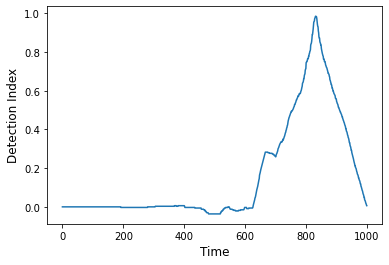
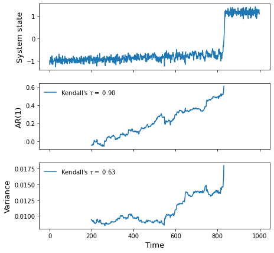
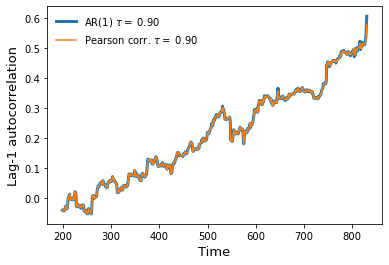
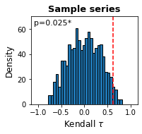

# regimeshifts

`regimeshifts` is a Python library that contains useful functions to detect early warning signals for an approaching regime shift on a time-series.

The indicators implemented in this library are lag-1 autocorrelation and variance. The rationale behind these indicators is based on a phenomenon known as Critical Slowing Down: as a system approaches gradually a tipping point, its recovery rate from perturbations decreases leading to an increase in similarity over time. Those changes can be detected by measuring changes in lag-1 autocorrelation and variance. Usually a tipping point is preceded by an increase in both metrics, if approached gradually ([see Scheffer et al. (2009)](https://doi.org/10.1038/nature08227)).

Since these metrics do not constitute a forecast tool to predict the distance to the tipping point, they are regarded as indicators of resilience and/or stability of a system ([see Dakos et al. (2015)](https://doi.org/10.1098/rstb.2013.0263)).

**Note:** This library is still under development, although the implemented methods are fairly tested. 

### Modules
`regimeshifts` contains two modules:

- `ews`: Contains useful methods to compute the resilience indicators, their robustness and significance.
- `regime_shifts`: Contains a method to detect regime shifts in a time-series.

This repository can be copied into the working directory using the command:

`https://github.com/BeatrizArellano/regimeshifts.git`

Both modules can be imported as follows (assuming the folder `regimeshifts` is at the same level of the script in which they are imported):


```python
from regimeshifts import regime_shifts as rs
from regimeshifts import ews
```

### Creating a time-series with a tipping point

`sample_rs` is a useful function in the module `regime_shifts` to create a time-series with a bifurcation and stochastic variability (normally distributed noise with specified standard deviation).


```python
ts = rs.sample_rs(std=0.1)
```


```python
import matplotlib.pyplot as plt
fig, ax = plt.subplots()
ts.plot(ax=ax)
ax.set_xlabel('Time',fontsize=12)
ax.set_ylabel('System state',fontsize=12);
```


    

    


## Detecting regime shifts

The class `Regime_shift` contains a useful method proposed by [Boulton and Lenton (2019)](https://doi.org/10.12688/f1000research.19310.1) to detect regime shifts in a time-series. This method looks for gradient changes that occur overa small time interval. 

First, we create an instance of the class `Regime_shifts` passing a `pandas` time-series as a parameter.


```python
ts = rs.Regime_shift(ts)
```

The method `as_detect` computes the detection indices returning a time-series containing values in the interval [-1,1] along the time-series. The greatest (smallest) values may indicate the occurrence of a regime shift.
In this example, the largest value is detected exactly when the tipping point is reached in the original series. 


```python
detection_index = ts.as_detect()
```


```python
fig, ax = plt.subplots()
detection_index.plot(ax=ax)
ax.set_xlabel('Time',fontsize=12)
ax.set_ylabel('Detection Index',fontsize=12);
```


    

    


The `before_rs` method can be used to extract the data before the regime-shift:


```python
bef_rs = ts.before_rs()
```


```python
fig, ax = plt.subplots()
bef_rs.plot(ax=ax)
ax.set_xlabel('Time',fontsize=12)
ax.set_ylabel('System state',fontsize=12);
```


    

    


## Early warning signals (resilience indicators)

From the proposed indicators for Critical Slowing Down in the literature, we included methods to measure temporal lag-1 autocorrelation and variance. The time-series are usually detrended prior to estimating the indicators ([see Lenton et al. (2012)](https://doi.org/10.1098/rsta.2011.0304)).

The class `Ews` (stands for Early Warning Signals) contains the methods to detrend the time-series, estimate the resilience indicators, measure the strength of change in their trend over time, their robustness and significance.

First, we create an instance of the class `Ews` passing a `Pandas` time-series or dataframe as parameter. 

Here we use the portion of the sample series before the regime shift.


```python
series = ews.Ews(bef_rs)
series = series.rename(columns={0:'Sample series'}) ## The Ews class returns an extended Dataframe object, if we provided a series, it sets 0 for the column name. 
```

The method `gaussian_det` can be used to remove the trend using a moving average weighed by a Gaussian function (or a Gaussian kernel smoother), which receives the bandwidth (`bW`) of the Gaussian smoother kernel as a parameter ([see Lenton et al. (2012)](https://doi.org/10.1098/rsta.2011.0304)).

This method returns a class containing the attributes: `trend` and `res` (residuals).


```python
trend = series.gaussian_det(bW=60).trend
residuals = series.gaussian_det(bW=60).res
```


```python
fig, axs = plt.subplots(2,1,sharex=True)
bef_rs.plot(ax=axs[0],label='')
trend['Sample series'].plot(ax=axs[0],label='Trend bW=60',linewidth=2)
residuals['Sample series'].plot(ax=axs[1])
axs[1].set_xlabel('Time',fontsize=12)
axs[0].set_ylabel('System state',fontsize=12);
axs[1].set_ylabel('Residuals',fontsize=12);
axs[0].legend(frameon=False);
```


    

    


### Estimating autocorrelation and variance

From the proposed indicators for Critical Slowing Down in the literature, we included methods to measure lag-1 autocorrelation and variance on time-series. They are computed over a sliding window with a size determined by the user (parameter `wL`). The sliding window can be set as a number of data points or as a proportion of the time series (e.g. wL=0.5). These methods can be applied over the detrended data or they can be applied directly to the raw data, in which the detrending step can be applied by setting `detrend=True` and providing the bandwidth size (`bW`). 

The methods to compute lag-1 autocorrelation are: `ar1()`, which fits an autoregressive model of order 1, and `pearsonc()`. The method `var()` computes variance. 


```python
wL = 200 ## Window length specified in number of points in the series
bW = 60
ar1 = series.ar1(detrend=True,bW=bW,wL=wL) ### Computing lag-1 autocorrelation using the ar1() method
var = series.var(detrend=True,bW=bW,wL=wL) ## Computing variance
```

### Measuring the trend in the indicators with the non-parametric Kendall's $\tau$ correlation coefficient

The Kendall $\tau$ coefficient cross-correlates time and the indicator series to assess the strength of change over time. The resulting coefficient ranges between -1 and 1: where values close to 1 indicate an increasing trend, and -1 a decreasing trend (see Lenton et al. (2012)). 

The Kendall coefficient is an attribute of the resulting indicator series and it is computed in this way:

`series.ar1(detrend=True,bW=bW,wL=wL).kendall`.


```python
print(f'AR(1) tau = {ar1.kendall:0.3f}')
print(f'Var tau = {var.kendall:0.3f}')
```

    AR(1) tau = 0.899
    Var tau = 0.628


```python
fig, axs = plt.subplots(3,1,sharex=True,figsize=(7,7))
ts.plot(ax=axs[0],legend=False)
ar1['Sample series'].plot(ax=axs[1],label=rf"Kendall's $\tau =$ {ar1.kendall:.2f}")
var['Sample series'].plot(ax=axs[2],label=rf"Kendall's $\tau =$ {var.kendall:.2f}")
axs[0].set_ylabel('System state',fontsize=13)
axs[1].set_ylabel('AR(1)',fontsize=13)
axs[2].set_ylabel('Variance',fontsize=13)
axs[1].legend(frameon=False)
axs[2].legend(frameon=False)
axs[2].set_xlabel('Time',fontsize=13);
```


    

    


#### AR(1) vs Pearson Correlation Coefficient

The method `ar1()` fits a first-order autoregressive model (AR(1)) using an ordinary least-squares method. This method uses the `statsmodels` `AutoReg` function, which is relatively computationally expensive compared with computing the Pearson correlation coefficient. The method `pearsonc` uses the `Pandas` `autocorr` function to estimate the correlation beween the time-series comprised by the window and the same time-series shifted by one time-unit. 

As we can see in this section, both methods yield the same results. 


```python
pearson = series.pearsonc(detrend=True,bW=bW,wL=wL) ### Computing lag-1 autocorrelation using the pearsonc() method
```


```python
fig,axs = plt.subplots()
ar1['Sample series'].plot(ax=axs,linewidth=3,label=rf"AR(1) $\tau =$ {ar1.kendall:.2f}")
pearson['Sample series'].plot(ax=axs,label=rf"Pearson corr. $\tau =$ {pearson.kendall:.2f}")
axs.legend(frameon=False)
axs.set_ylabel('Lag-1 autocorrelation',fontsize=13)
axs.set_xlabel('Time',fontsize=13);
```


    

    


### Assessing significance

A proposed method to measure whether a trend is significant consists in comparing the measured trend with the expected trends from a null model. The null model consists of a large-enough number of surrogate series, each series having the same spectral properties as the original series ([see Dakos et al. (2012)](https://doi.org/10.1371/journal.pone.0041010)). This can be achieved by using a bootstrapping method: sampling with replacement from the residuals of the original time-series ([see Boulton et al. (2014)](https://doi.org/10.1038/ncomms6752)). The Kendall $\tau$ coefficient is measured for each surrogate series and the $p$-value is then defined as the proportion of series that exhibit a $\tau$-value greater (smaller) than or equal to that observed in the original series.

The function `significance` follows this method to return an object with the following attributes:

- `indicator`: The resilience indicator
- `surrog_kendalls`: a `Pandas dataframe` containing the Kendall values measured on each surrogate series.
- `kendall_coeff`: The Kendall coefficient for the indicator's trend computed on the original series
- `pvalue`: The p-value
- `test_type`: Positive or negative, defined to assess whether the trend is significantly positive or negative. 
- `plot()`: Method to plot the output from the test.


```python
sig_pearson = series.significance(indicator='pearsonc',n=1000,detrend=True,wL=wL,bW=bW,test='positive')
```


```python
sig_variance = series.significance(indicator='var',n=1000,detrend=True,wL=wL,bW=bW,test='positive')
```


```python
sig_variance.pvalue
```


    Sample series    0.025
    dtype: float64


```python
print(f'Lag-1 autocorrelation p-value: {sig_pearson.pvalue["Sample series"]}')
print(f'Variance p-value: {sig_variance.pvalue["Sample series"]}')
```

    Lag-1 autocorrelation p-value: 0.0
    Variance p-value: 0.025


#### Visualising the significance test

The `plot()` method plots the distribution of Kendall $\tau$ values obtained from the surrogate series and a red vertical line that indicates the Kendall coefficient measured on the original series. 


```python
sig_pearson.plot()
```


    

    


```python
sig_variance.plot()
```


    

    


### Robustness analysis

The method `robustness()` measures the trends for the specified indicators over a range of combinations of window lengths and detrending bandwidths.

This method receives as parameters the indicators to assess, the minimum and maximum window length (`min_wL` and `max_wL`) as well as its resolution (`res_wL`). Likewise for the detrending bandwidth (`min_bW`,`max_bW`,`res_bW`).

This method returns a dictionary in which the keys correspond to the dataframe column names. Each key is associated to another dictionary containing Pandas dataframes with the Kendall values across all the combination of parameters (The columns corresponding to each window size and the indices to the different bandwidths).


```python
rob = series.robustness(indicators=['pearsonc','var'])
```


```python
rob['Sample series']['pearsonc']
```


<div>
<style scoped>
    .dataframe tbody tr th:only-of-type {
        vertical-align: middle;
    }

    .dataframe tbody tr th {
        vertical-align: top;
    }

    .dataframe thead th {
        text-align: right;
    }
</style>
<table border="1" class="dataframe">
  <thead>
    <tr style="text-align: right;">
      <th></th>
      <th>166</th>
      <th>181</th>
      <th>196</th>
      <th>211</th>
      <th>226</th>
      <th>241</th>
      <th>256</th>
      <th>271</th>
      <th>286</th>
      <th>301</th>
      <th>...</th>
      <th>436</th>
      <th>451</th>
      <th>466</th>
      <th>481</th>
      <th>496</th>
      <th>511</th>
      <th>526</th>
      <th>541</th>
      <th>556</th>
      <th>571</th>
    </tr>
    <tr>
      <th>Bandwidth</th>
      <th></th>
      <th></th>
      <th></th>
      <th></th>
      <th></th>
      <th></th>
      <th></th>
      <th></th>
      <th></th>
      <th></th>
      <th></th>
      <th></th>
      <th></th>
      <th></th>
      <th></th>
      <th></th>
      <th></th>
      <th></th>
      <th></th>
      <th></th>
      <th></th>
    </tr>
  </thead>
  <tbody>
    <tr>
      <th>83</th>
      <td>0.897880</td>
      <td>0.906709</td>
      <td>0.898202</td>
      <td>0.908233</td>
      <td>0.921512</td>
      <td>0.930012</td>
      <td>0.929239</td>
      <td>0.924153</td>
      <td>0.931068</td>
      <td>0.945351</td>
      <td>...</td>
      <td>0.942360</td>
      <td>0.941484</td>
      <td>0.959159</td>
      <td>0.971282</td>
      <td>0.955082</td>
      <td>0.929167</td>
      <td>0.939698</td>
      <td>0.955682</td>
      <td>0.963109</td>
      <td>0.961273</td>
    </tr>
    <tr>
      <th>88</th>
      <td>0.898539</td>
      <td>0.906728</td>
      <td>0.898450</td>
      <td>0.908597</td>
      <td>0.921054</td>
      <td>0.929634</td>
      <td>0.929300</td>
      <td>0.924281</td>
      <td>0.931095</td>
      <td>0.945379</td>
      <td>...</td>
      <td>0.942488</td>
      <td>0.941484</td>
      <td>0.959219</td>
      <td>0.971282</td>
      <td>0.955402</td>
      <td>0.929517</td>
      <td>0.939698</td>
      <td>0.955872</td>
      <td>0.963109</td>
      <td>0.961096</td>
    </tr>
    <tr>
      <th>93</th>
      <td>0.898864</td>
      <td>0.907068</td>
      <td>0.898351</td>
      <td>0.908805</td>
      <td>0.920825</td>
      <td>0.929232</td>
      <td>0.929203</td>
      <td>0.924191</td>
      <td>0.931001</td>
      <td>0.945535</td>
      <td>...</td>
      <td>0.942463</td>
      <td>0.941567</td>
      <td>0.959368</td>
      <td>0.971412</td>
      <td>0.955544</td>
      <td>0.929361</td>
      <td>0.939912</td>
      <td>0.955966</td>
      <td>0.963215</td>
      <td>0.960743</td>
    </tr>
    <tr>
      <th>98</th>
      <td>0.898855</td>
      <td>0.907078</td>
      <td>0.898192</td>
      <td>0.908826</td>
      <td>0.920705</td>
      <td>0.928934</td>
      <td>0.929130</td>
      <td>0.924141</td>
      <td>0.930961</td>
      <td>0.945649</td>
      <td>...</td>
      <td>0.942411</td>
      <td>0.941484</td>
      <td>0.959398</td>
      <td>0.971445</td>
      <td>0.955579</td>
      <td>0.929322</td>
      <td>0.939569</td>
      <td>0.955919</td>
      <td>0.963162</td>
      <td>0.960566</td>
    </tr>
    <tr>
      <th>103</th>
      <td>0.898711</td>
      <td>0.907068</td>
      <td>0.898321</td>
      <td>0.908981</td>
      <td>0.920541</td>
      <td>0.928613</td>
      <td>0.929130</td>
      <td>0.924141</td>
      <td>0.930974</td>
      <td>0.945663</td>
      <td>...</td>
      <td>0.942360</td>
      <td>0.941428</td>
      <td>0.959219</td>
      <td>0.971282</td>
      <td>0.955757</td>
      <td>0.929206</td>
      <td>0.939312</td>
      <td>0.955872</td>
      <td>0.963320</td>
      <td>0.960389</td>
    </tr>
    <tr>
      <th>...</th>
      <td>...</td>
      <td>...</td>
      <td>...</td>
      <td>...</td>
      <td>...</td>
      <td>...</td>
      <td>...</td>
      <td>...</td>
      <td>...</td>
      <td>...</td>
      <td>...</td>
      <td>...</td>
      <td>...</td>
      <td>...</td>
      <td>...</td>
      <td>...</td>
      <td>...</td>
      <td>...</td>
      <td>...</td>
      <td>...</td>
      <td>...</td>
    </tr>
    <tr>
      <th>473</th>
      <td>0.891829</td>
      <td>0.906426</td>
      <td>0.896479</td>
      <td>0.903039</td>
      <td>0.916974</td>
      <td>0.927454</td>
      <td>0.933104</td>
      <td>0.924497</td>
      <td>0.930141</td>
      <td>0.944128</td>
      <td>...</td>
      <td>0.938524</td>
      <td>0.941539</td>
      <td>0.956853</td>
      <td>0.968352</td>
      <td>0.949609</td>
      <td>0.927375</td>
      <td>0.936783</td>
      <td>0.952648</td>
      <td>0.961476</td>
      <td>0.958680</td>
    </tr>
    <tr>
      <th>478</th>
      <td>0.891811</td>
      <td>0.906426</td>
      <td>0.896519</td>
      <td>0.903101</td>
      <td>0.916963</td>
      <td>0.927512</td>
      <td>0.933043</td>
      <td>0.924382</td>
      <td>0.930114</td>
      <td>0.944100</td>
      <td>...</td>
      <td>0.938345</td>
      <td>0.941539</td>
      <td>0.956913</td>
      <td>0.968254</td>
      <td>0.949183</td>
      <td>0.927220</td>
      <td>0.936869</td>
      <td>0.952601</td>
      <td>0.961370</td>
      <td>0.958680</td>
    </tr>
    <tr>
      <th>483</th>
      <td>0.891621</td>
      <td>0.906530</td>
      <td>0.896509</td>
      <td>0.903049</td>
      <td>0.916963</td>
      <td>0.927546</td>
      <td>0.933128</td>
      <td>0.924230</td>
      <td>0.930127</td>
      <td>0.944086</td>
      <td>...</td>
      <td>0.938371</td>
      <td>0.941622</td>
      <td>0.956973</td>
      <td>0.968059</td>
      <td>0.948934</td>
      <td>0.927336</td>
      <td>0.936783</td>
      <td>0.952601</td>
      <td>0.961370</td>
      <td>0.958680</td>
    </tr>
    <tr>
      <th>488</th>
      <td>0.891504</td>
      <td>0.906567</td>
      <td>0.896469</td>
      <td>0.903028</td>
      <td>0.916995</td>
      <td>0.927546</td>
      <td>0.933128</td>
      <td>0.924166</td>
      <td>0.930262</td>
      <td>0.944071</td>
      <td>...</td>
      <td>0.938294</td>
      <td>0.941484</td>
      <td>0.957003</td>
      <td>0.967896</td>
      <td>0.948756</td>
      <td>0.927142</td>
      <td>0.936783</td>
      <td>0.952364</td>
      <td>0.961159</td>
      <td>0.958562</td>
    </tr>
    <tr>
      <th>493</th>
      <td>0.891323</td>
      <td>0.906577</td>
      <td>0.896390</td>
      <td>0.902956</td>
      <td>0.916984</td>
      <td>0.927569</td>
      <td>0.933056</td>
      <td>0.924026</td>
      <td>0.930235</td>
      <td>0.944000</td>
      <td>...</td>
      <td>0.938115</td>
      <td>0.941345</td>
      <td>0.957033</td>
      <td>0.967993</td>
      <td>0.948579</td>
      <td>0.927064</td>
      <td>0.936869</td>
      <td>0.952506</td>
      <td>0.961265</td>
      <td>0.958562</td>
    </tr>
  </tbody>
</table>
<p>83 rows × 28 columns</p>
</div>


#### Robustness figures

The robustness results can be represented as colourmaps by using the `plot()` method. In this method, the parameters `vmin`,`vmax`,`cmap` and other arguments for the `Matplotlib pcolormesh` function can be specified.


```python
rob.plot(vmin=0.1,cmap='viridis')
```


    

    


### References

- Boulton, C. A., & Lenton, T. M. (2019). A new method for detecting abrupt shifts in time series. F1000Research, 8, 746. https://doi.org/10.12688/f1000research.19310.1

- Boulton, C. A., Allison, L. C., & Lenton, T. M. (2014). Early warning signals of Atlantic Meridional Overturning Circulation collapse in a fully coupled climate model. Nature Communications, 5(1), 1–9. https://doi.org/10.1038/ncomms6752

- Dakos, V., Carpenter, S. R., van Nes, E. H., & Scheffer, M. (2015). Resilience indicators: Prospects and limitations for early warnings of regime shifts. Philosophical Transactions of the Royal Society B: Biological Sciences, 370(1659), 20130263. https://doi.org/10.1098/rstb.2013.0263

- Dakos, V., Carpenter, S. R., Brock, W. A., Ellison, A. M., Guttal, V., Ives, A. R., Kéfi, S., Livina, V., Seekell, D. A., van Nes, E. H., & Scheffer, M. (2012). Methods for Detecting Early Warnings of Critical Transitions in Time Series Illustrated Using Simulated Ecological Data. PLoS ONE, 7(7), e41010. https://doi.org/10.1371/journal.pone.0041010

- Lenton, T. M., Livina, V. N., Dakos, V., van Nes, E. H., & Scheffer, M. (2012). Early warning of climate tipping points from critical slowing down: Comparing methods to improve robustness. Philosophical Transactions of the Royal Society A: Mathematical, Physical and Engineering Sciences, 370(1962), 1185–1204. https://doi.org/10.1098/rsta.2011.0304

- Scheffer, M., Bascompte, J., Brock, W. A., Brovkin, V., Carpenter, S. R., Dakos, V., Held, H., van Nes, E. H., Rietkerk, M., & Sugihara, G. (2009). Early-warning signals for critical transitions. Nature, 461(7260), 53–59. https://doi.org/10.1038/nature08227


```python

```
